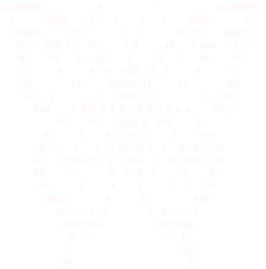

  
 

### 👋 Hi there, I'm Anush 

*Developer / Designer / Tech Enthusiast*

Welcome to my digital garden! I love blending clean code with creative elements.

* 🔭 **Currently working on:** [Your Project Name]
* 🌱 **Currently learning:** [e.g., Rust, Machine Learning]
* 👯 **Looking to collaborate on:** Open source creative projects
* 💬 **Ask me about:** [Your expertise]
* 📫 **How to reach me:** [Your Email or LinkedIn]
---

 

### 🛠️ Languages & Tools

  
  
  
  
  

---

### 📈 GitHub Stats

  
  

